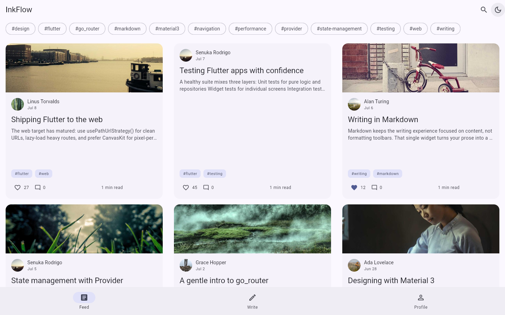
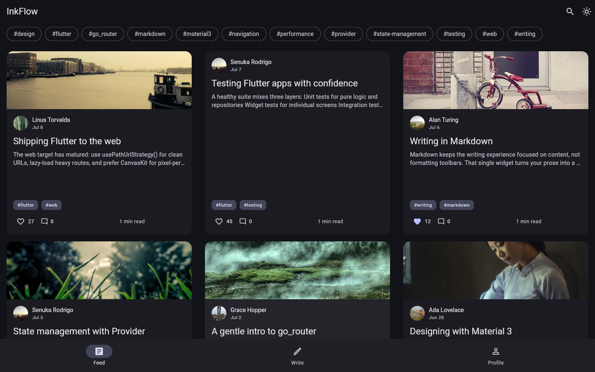
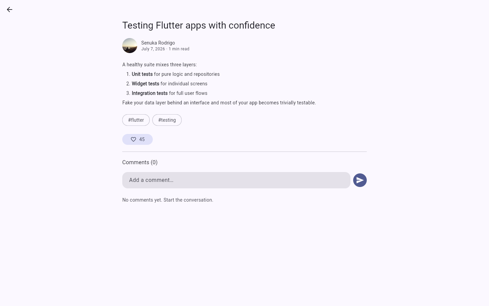

# InkFlow

InkFlow is a cross-platform blogging application for Android, iOS, and web, built with Flutter. Readers browse a searchable, tag-filterable feed that reflows from a single column on phones to a multi-column grid on desktop, open posts rendered from Markdown, and like or comment on them; writers compose new posts in a Markdown editor with a live preview. The app is structured with an MVVM layering (UI → domain → data), uses `go_router` for declarative deep-linkable navigation and `provider` for dependency injection and state, and reads all of its data through a `PostRepository` interface that is backed by an in-memory mock today and by Firebase (Firestore) next.

**Status:** In progress — frontend phase complete, Firebase backend phase next.

## Screenshots

| Feed (light) | Feed (dark) |
| --- | --- |
|  |  |



## Features

- **Feed** — searchable and filterable by tag, with pull-to-refresh, optimistic likes, and loading, error, and empty states.
- **Responsive layout** — one column on phones; above 720px the feed becomes a grid of cards capped at 520px, so a resized desktop window reflows correctly.
- **Post detail** — deep-linkable at `/post/:id`, with selectable Markdown, tags, likes, and a comment composer.
- **Editor** — write Markdown with a live preview toggle, validation, and publish.
- **Profile** — the signed-in author's avatar, bio, stats, and published posts.
- **Auth UI** — email and password form with validation and a login/signup toggle (not yet wired to a backend).
- **Light and dark themes** — Material 3, generated from a single seed color, toggleable from the feed.

## Architecture

The app is layered so that each piece has one reason to change, and so the UI never knows where its data comes from.

```text
lib/
├── domain/
│   └── models/            # Immutable models: Author, Post, Comment
├── data/
│   └── repositories/      # PostRepository (abstract) + MockPostRepository
├── routing/               # go_router: nav shell, deep links, per-route view models
├── ui/
│   ├── core/              # Material 3 theme, ThemeController, shared widgets
│   └── features/          # One folder per feature: views/ + view_models/
│       ├── feed/
│       ├── post_detail/
│       ├── editor/
│       ├── auth/
│       └── profile/
└── main.dart              # Entry point; wires providers, theme, and router
```

**MVVM.** Each feature owns a `view_models/` and a `views/`. A view model is a `ChangeNotifier` holding presentation state — a status enum, the data, and the in-flight flags — and exposing intent methods such as `toggleLike()` or `publish()`. Views render that state and forward user intent; they hold no business logic, which is what makes the widget tests read as behaviour rather than as plumbing. View models never import Flutter's widget layer, so they are testable as plain Dart.

**The repository interface is the seam.** The UI depends only on the abstract `PostRepository`, never on a concrete implementation. `MockPostRepository` serves seeded data from memory with simulated network latency, which is why the whole app is demonstrable and testable with no backend. Swapping in a `FirestorePostRepository` means writing one class and changing one line in `main.dart` — no screen or view model changes.

**Cross-screen consistency.** Screens keep their own copy of the posts they display, so a like on the detail screen would otherwise leave a stale count behind it in the feed. `PostRepository` therefore exposes a `postChanges` stream that emits whenever a post's stored state changes; the feed and profile listen and patch the post they already hold instead of re-fetching. A Firestore snapshot listener has the same shape, so this behaviour survives the backend swap.

## Getting started

Prerequisites: the [Flutter SDK](https://docs.flutter.dev/get-started/install) (stable channel).

```bash
# Install dependencies
flutter pub get

# Run on Chrome (web)
flutter run -d chrome
```

To run on a connected Android or iOS device or emulator, use `flutter run` and pick a target, or run `flutter devices` to see what is available.

## Development

```bash
flutter analyze   # static analysis
flutter test      # unit and widget tests
```

## Roadmap

Frontend phase — complete:

- [x] Domain models and a mock-backed repository behind an interface
- [x] `go_router` navigation shell with deep links
- [x] Feed: search, tag filters, optimistic likes, responsive grid
- [x] Post detail: Markdown rendering, likes, comments
- [x] Markdown editor with live preview and validation
- [x] Profile with the author's published posts
- [x] Auth UI with form validation
- [x] Light and dark themes with a runtime toggle

Backend phase — next:

- [ ] Wire Firebase Auth into the existing auth UI (see the TODO in `LoginViewModel.submit`)
- [ ] Guard the shell routes behind a `go_router` redirect on auth state
- [ ] Implement `FirestorePostRepository` and swap it in at `main.dart`
- [ ] Move likes and comments to Firestore, backing `postChanges` with snapshot listeners
- [ ] Upload cover images to Firebase Storage
- [ ] Persist the theme choice
- [ ] Paginate the feed
